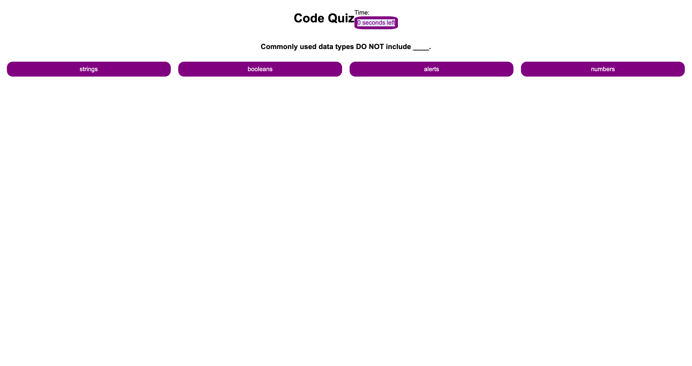

# Code Quiz

## Creating a Code Quiz to help software developers test their knowledge on JavaScript and prepare them for technical interview questions.

This is a quiz that asks questions about JavaScript to test user knowledge. It includes:
- 5 questions with 4 options to choose from. Only one will be correct.
- You are given 75 seconds to complete quiz. 
- Every question user gets wrong deducts 15 seconds from timer.
- At the end you must provide initials to save you score. 

## Installation

N/A

## Usage
- This is the link to the deployed website
https://darvinmarte.github.io/code-quiz/

## Credits

N/A

## License

Please refer to the LICENSE in the repo.